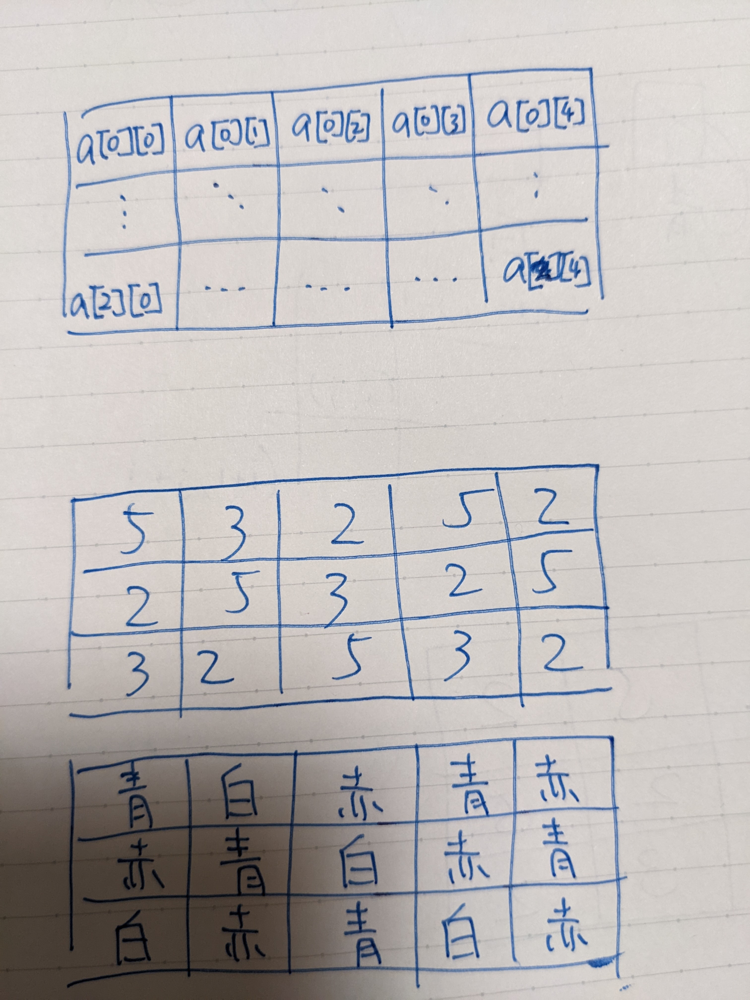

タイル貼り
===

タイルのセットを買った。赤、青、白のタイルが含まれている。このタイルをある制約の元、配置したい。

# セットに含まれるタイル


# タイルの配置

以下のようにタイルを配置したい。


# 配置の制約

以下の制約の元で配置したい。


# アイディア

色に以下のように素数を割り当てて、Z3ソルバで解く。

- 赤: 2
- 白: 3
- 青: 5

この素数を要素とする二次元配列をZ3ソルバで求める。

# 答え

```
$ python3 tile.py
[a_2_4 = 2,
 a_2_3 = 3,
 a_2_2 = 5,
 a_2_1 = 2,
 a_2_0 = 3,
 a_1_4 = 5,
 a_1_3 = 2,
 a_1_2 = 3,
 a_1_1 = 5,
 a_1_0 = 2,
 a_0_4 = 2,
 a_0_3 = 5,
 a_0_2 = 2,
 a_0_1 = 3,
 a_0_0 = 5]
```


